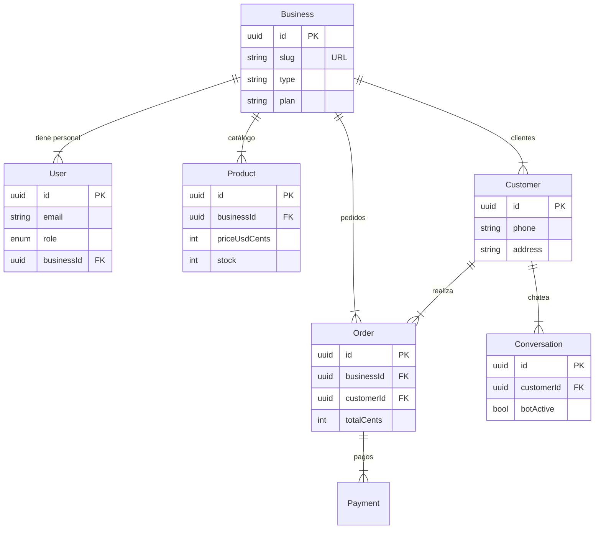

# Arquitectura Técnica - VentasVE

## Índice

*   [�️ Base de Datos](#-base-de-datos-postgresql)
*   [🔐 Autenticación](#-autenticación)
*   [📁 Estructura](#-estructura-del-proyecto-monorepo)
*   [⚡ Prisma Schema](#-prisma-schema)
*   [🔌 API Routes](#-api-routes-v1)

---

## �️ Tech Stack

*   **Frontend**: Next.js 15 (App Router), React 19, TailwindCSS, Lucide Icons, Zustand.
*   **Backend**: Node.js, Express, TypeScript, Zod.
*   **Base de Datos**: PostgreSQL 15, Prisma ORM.
*   **Infraestructura**: Docker, pnpm workspaces (Monorepo).
*   **Integraciones**: WhatsApp (Baileys), Cloudflare R2 (Imágenes).

---

## 🗄️ Base de Datos (PostgreSQL)

**Diseño para el contexto venezolano**: multi-divisa, multi-método de pago, con soporte para chatbot, pedidos y catálogo público por tenant.

> **💡 Decisión de arquitectura:**
> Cada negocio (Business) es un tenant independiente. Todos los datos están aislados por `businessId`. Los precios se guardan siempre en centavos USD (Integer) para evitar errores de punto flotante. La conversión a Bs. se hace en tiempo real.

### Diagrama de Relaciones



### Detalle de Tablas Core

#### 🏪 businesses
Tenant raíz — cada negocio registrado.

| Campo | Tipo | Restricción | Descripción |
| :--- | :--- | :--- | :--- |
| `id` | UUID | **PK** · DEFAULT gen_random_uuid() | Identificador único del negocio |
| `slug` | VARCHAR(60) | **UNIQUE** · NOT NULL | URL del catálogo: `ventasve.app/c/{slug}` |
| `name` | VARCHAR(120) | NOT NULL | Nombre visible de la tienda |
| `type` | BusinessType | **ENUM** · NOT NULL | FASHION, FOOD, BEAUTY, TECH, GROCERY… |
| `plan` | Plan | **ENUM** · DEFAULT FREE | FREE, PRO, BUSINESS |
| `whatsapp` | VARCHAR(20) | NOT NULL | +58 con código de país |
| `city` | VARCHAR(80) | | Ciudad principal de operación |
| `settings` | JSONB | DEFAULT '{}' | Config flexible: colores, módulos, campos del ramo |
| `isActive` | BOOLEAN | DEFAULT true | Pausar tienda temporalmente |
| `createdAt` | TIMESTAMPTZ | DEFAULT NOW() | |

#### 📦 products
Catálogo de cada negocio.

| Campo | Tipo | Restricción | Descripción |
| :--- | :--- | :--- | :--- |
| `id` | UUID | **PK** | |
| `businessId` | UUID | **FK** → businesses | Aislamiento por tenant |
| `name` | VARCHAR(200) | NOT NULL | Nombre del producto |
| `description` | TEXT | | |
| `priceUsdCents` | INTEGER | NOT NULL · CHECK ≥ 0 | Precio en centavos USD (1200 = $12.00) |
| `stock` | INTEGER | DEFAULT 0 | Unidades disponibles |
| `images` | TEXT[] | | Array de URLs (Cloudinary/R2) |
| `variants` | JSONB | DEFAULT '[]' | `[{name:"Talla",options:["S","M"]}]` |
| `attributes` | JSONB | DEFAULT '{}' | Campos del ramo: color, material, talla, etc. |
| `categoryId` | UUID | **FK** → categories | |
| `isPublished` | BOOLEAN | DEFAULT true | Visible en catálogo público |
| `deletedAt` | TIMESTAMPTZ | NULLABLE | Soft delete |

#### 🛒 orders
Pedidos con trazabilidad completa.

| Campo | Tipo | Restricción | Descripción |
| :--- | :--- | :--- | :--- |
| `id` | UUID | **PK** | |
| `orderNumber` | SERIAL | **IDX** | Número legible: #1044 |
| `businessId` | UUID | **FK** → businesses | |
| `customerId` | UUID | **FK** → customers | |
| `status` | OrderStatus | **ENUM** | PENDING · CONFIRMED · PREPARING · SHIPPED · DELIVERED · CANCELLED |
| `totalCents` | INTEGER | NOT NULL | Total en centavos USD |
| `exchangeRate` | DECIMAL(12,2) | | Tasa del día al momento del pedido |
| `paymentMethod` | PaymentMethod | **ENUM** | ZELLE · PAGO_MOVIL · BINANCE · CASH_USD · TRANSFER_BS · CRYPTO |
| `deliveryAddress` | TEXT | | |
| `notes` | TEXT | | Notas del cliente |
| `source` | OrderSource | **ENUM** | WEB · WHATSAPP · BOT · MANUAL |
| `createdAt` | TIMESTAMPTZ | DEFAULT NOW() | |

#### 💳 payments
Registro y conciliación de pagos venezolanos.

| Campo | Tipo | Restricción | Descripción |
| :--- | :--- | :--- | :--- |
| `id` | UUID | **PK** | |
| `orderId` | UUID | **FK** → orders | |
| `businessId` | UUID | **FK** → businesses | |
| `method` | PaymentMethod | **ENUM** | ZELLE · PAGO_MOVIL · BINANCE · CASH_USD · TRANSFER_BS · CRYPTO |
| `amountCents` | INTEGER | NOT NULL | Monto en centavos de la moneda pagada |
| `currency` | VARCHAR(5) | NOT NULL | USD · VES · USDT · BTC |
| `reference` | VARCHAR(200) | | Ref Zelle, teléfono PM, hash Binance… |
| `proofImageUrl` | TEXT | | URL del comprobante subido |
| `status` | PaymentStatus | **ENUM** | PENDING · VERIFIED · REJECTED |
| `verifiedAt` | TIMESTAMPTZ | NULLABLE | Cuando fue confirmado el pago |
| `verifiedBy` | UUID | **FK** → users | null si fue verificado por el bot |

#### 💬 conversations + messages
Inbox unificado y chatbot.

| Campo | Tipo | Restricción | Descripción |
| :--- | :--- | :--- | :--- |
| `conv.channel` | Channel | **ENUM** | WHATSAPP · INSTAGRAM · WEB |
| `conv.botActive` | BOOLEAN | DEFAULT true | false = humano tomó el control |
| `conv.status` | ConvStatus | **ENUM** | OPEN · BOT · HUMAN · CLOSED |
| `msg.role` | MsgRole | **ENUM** | CUSTOMER · BOT · AGENT |
| `msg.content` | TEXT | NOT NULL | Texto del mensaje |
| `msg.mediaUrl` | TEXT | NULLABLE | URL de adjunto |
| `msg.waId` | VARCHAR(100) | NULLABLE | ID WhatsApp para evitar duplicados |

> **✅ Otras tablas necesarias (Total 12):** `order_items`, `exchange_rates`, `categories`, `sessions`, `notifications`.

---

## 🔐 Autenticación

**Estrategia**: JWT (Stateless) + Refresh Token Rotation.

1.  **Access Token**: JWT con vida corta (15 min). Contiene `{ userId, businessId, role }`.
2.  **Refresh Token**: Token opaco de larga duración (30 días). Almacenado en DB y Cookie `HttpOnly`.
3.  **Roles**:
    *   `OWNER`: Acceso total (configuración, pagos, usuarios).
    *   `AGENT`: Operativo (pedidos, chat, productos).
    *   `SUPER_ADMIN`: Soporte global.

### Flujos Principales

1.  **Registro**: Crea Business + User (Owner).
2.  **Login**: Retorna Access Token (Body) + Refresh Token (Cookie).
3.  **Refresh**: Usa cookie para obtener nuevo Access Token. Detecta reutilización de tokens (robo).

---

## 📂 Estructura del Proyecto (Monorepo)

**Monorepo · Next.js + Node.js**
Un único repositorio con frontend y backend separados. El catálogo público y el dashboard corren en Next.js. El backend API es Node.js/Express independiente, más fácil de escalar.

*   Next.js 15 (App Router)
*   Node.js + Express
*   pnpm workspaces
*   Prisma ORM
*   TypeScript strict

### Estructura completa del monorepo

#### 📂 Raíz
```text
ventasve/
├── package.json          ← workspace root
├── pnpm-workspace.yaml
├── turbo.json            ← build pipeline
├── .env.example
├── README.md
├── docker-compose.yml    ← local dev
├── .gitignore
│
├── apps/
│   ├── frontend/         ← Next.js
│   └── backend/          ← Express API
│
└── packages/
    ├── database/         ← Prisma schema
    ├── types/            ← TypeScript compartido
    └── utils/            ← helpers compartidos
```

#### 🗄️ packages/database/
**Prisma**
```text
packages/database/
├── schema.prisma         ← definición de modelos
├── package.json
├── migrations/
│   ├── 20250101_init.sql
│   └── 20250115_add_chat.sql
├── seeds/
│   ├── index.ts          ← datos de prueba
│   └── business.seed.ts
└── src/
    ├── client.ts         ← singleton PrismaClient
    └── index.ts          ← re-exports
```

#### ⚛️ apps/frontend/
**Next.js 15**
```text
apps/frontend/
├── next.config.ts
├── tailwind.config.ts
├── .env.local
│
├── src/app/              ← App Router
│   ├── layout.tsx        ← root layout
│   ├── page.tsx          ← landing /
│   │
│   ├── (auth)/           ← sin sidebar
│   │   ├── login/page.tsx
│   │   └── register/page.tsx
│   │
│   ├── (dashboard)/      ← con sidebar
│   │   ├── layout.tsx    ← sidebar + topbar
│   │   ├── page.tsx      ← /dashboard
│   │   ├── orders/
│   │   │   ├── page.tsx      ← lista pedidos
│   │   │   └── [id]/page.tsx ← detalle pedido
│   │   ├── products/
│   │   │   ├── page.tsx
│   │   │   ├── new/page.tsx
│   │   │   └── [id]/edit/page.tsx
│   │   ├── payments/page.tsx
│   │   ├── inbox/page.tsx
│   │   ├── chatbot/page.tsx
│   │   └── settings/page.tsx
│   │
│   └── c/[slug]/         ← CATÁLOGO PÚBLICO
│       ├── page.tsx          ← vitrina del cliente
│       ├── checkout/page.tsx
│       └── order/[id]/page.tsx ← confirmación
│
├── src/components/
│   ├── ui/               ← botones, inputs, cards
│   ├── dashboard/        ← sidebar, topbar
│   ├── catalog/          ← ProductCard, Cart
│   ├── chat/             ← MessageBubble, Inbox
│   └── payments/         ← PaymentFlow
│
├── src/lib/
│   ├── api.ts            ← fetch wrapper + auth
│   ├── auth.ts           ← token helpers
│   └── exchange-rate.ts  ← conversión VES/USD
│
├── src/hooks/
│   ├── useAuth.ts
│   ├── useOrders.ts
│   ├── useProducts.ts
│   └── useExchangeRate.ts
│
└── src/store/            ← Zustand
    ├── cart.store.ts
    └── auth.store.ts
```

#### ⚡ apps/backend/
**Express API**
```text
apps/backend/
├── package.json
├── .env
├── tsconfig.json
│
├── src/
│   ├── app.ts            ← Express setup + middlewares
│   ├── server.ts         ← puerto + arranque
│   │
│   ├── routes/
│   │   ├── auth.routes.ts
│   │   ├── business.routes.ts
│   │   ├── products.routes.ts
│   │   ├── orders.routes.ts
│   │   ├── payments.routes.ts
│   │   ├── catalog.routes.ts     ← público, sin auth
│   │   ├── chat.routes.ts
│   │   └── webhook.routes.ts     ← WhatsApp / Meta
│   │
│   ├── controllers/
│   │   ├── auth.controller.ts
│   │   ├── orders.controller.ts
│   │   ├── payments.controller.ts
│   │   └── catalog.controller.ts
│   │
│   ├── services/         ← lógica de negocio
│   │   ├── auth.service.ts
│   │   ├── order.service.ts
│   │   ├── payment.service.ts
│   │   ├── chatbot.service.ts
│   │   ├── whatsapp.service.ts
│   │   ├── exchange-rate.service.ts
│   │   └── notification.service.ts
│   │
│   ├── middleware/
│   │   ├── auth.ts       ← authenticate, requireRole
│   │   ├── rate-limit.ts
│   │   ├── validate.ts   ← Zod middleware
│   │   └── tenant.ts     ← inyectar businessId
│   │
│   ├── jobs/             ← tareas programadas
│   │   ├── exchange-rate.job.ts  ← actualizar tasa BCV 8AM
│   │   └── order-reminder.job.ts ← recordatorio de pago
│   │
│   ├── lib/
│   │   ├── prisma.ts     ← singleton db client
│   │   ├── redis.ts      ← cache + queues
│   │   ├── storage.ts    ← Cloudflare R2 / S3
│   │   └── baileys.ts    ← cliente WhatsApp
│   │
│   ├── validators/       ← Zod schemas
│   │   ├── order.schema.ts
│   │   ├── product.schema.ts
│   │   └── payment.schema.ts
│   │
│   └── types/
│       ├── express.d.ts  ← augment req.user
│       └── index.ts
```

> **⚠️ Regla de oro:** Los `controllers` solo manejan HTTP (request/response). Toda la lógica va en `services`. Esto hace que el chatbot pueda llamar directamente a `order.service.ts` sin pasar por HTTP — lo cual es esencial para el bot.

---

## 💎 Prisma Schema

```prisma
// ── GENERADOR Y DATASOURCE ──────────────────────────
generator client {
  provider = "prisma-client-js"
}

datasource db {
  provider = "postgresql"
  url      = env("DATABASE_URL")
}

// ── ENUMS ────────────────────────────────────────────
enum BusinessType {
  FASHION FOOD BEAUTY TECH GROCERY HOME HEALTH
  EDUCATION AUTO SERVICE PET OTHER
}

enum Plan         { FREE PRO BUSINESS }
enum Role         { OWNER AGENT SUPER_ADMIN }
enum OrderStatus  { PENDING CONFIRMED PREPARING SHIPPED DELIVERED CANCELLED }
enum OrderSource  { WEB WHATSAPP BOT MANUAL }
enum PaymentMethod {
  ZELLE PAGO_MOVIL BINANCE CASH_USD TRANSFER_BS CRYPTO
}
enum PaymentStatus { PENDING VERIFIED REJECTED }
enum Channel       { WHATSAPP INSTAGRAM WEB }
enum ConvStatus    { OPEN BOT HUMAN CLOSED }
enum MsgRole       { CUSTOMER BOT AGENT }

// ── MODELS ───────────────────────────────────────────
model Business {
  id          String       @id @default(uuid())
  slug        String       @unique
  name        String
  type        BusinessType
  plan        Plan         @default(FREE)
  whatsapp    String
  city        String?
  settings    Json         @default("{}")  // colores, módulos, campos del ramo
  isActive    Boolean      @default(true)
  createdAt   DateTime     @default(now())

  // Relaciones
  users         User[]
  products      Product[]
  categories    Category[]
  orders        Order[]
  customers     Customer[]
  paymentConfig PaymentConfig[]
  exchangeRates ExchangeRate[]
}

model User {
  id           String    @id @default(uuid())
  businessId   String
  email        String    @unique
  passwordHash String
  name         String
  role         Role      @default(AGENT)
  isVerified   Boolean   @default(false)
  createdAt    DateTime  @default(now())

  business  Business  @relation(fields: [businessId], references: [id])
  sessions  Session[]

  @@index([businessId])
}

model Session {
  id          String    @id @default(uuid())
  userId      String
  token       String    @unique  // hashed refresh token
  userAgent   String?
  expiresAt   DateTime
  revokedAt   DateTime?
  createdAt   DateTime  @default(now())

  user  User  @relation(fields: [userId], references: [id])
  @@index([userId])
}

model Product {
  id              String    @id @default(uuid())
  businessId      String
  categoryId      String?
  name            String
  description     String?
  priceUsdCents   Int       // 1200 = $12.00
  stock           Int       @default(0)
  images          String[]
  variants        Json      @default("[]")
  attributes      Json      @default("{}")   // campos del ramo
  isPublished     Boolean   @default(true)
  deletedAt       DateTime?
  createdAt       DateTime  @default(now())
  updatedAt       DateTime  @updatedAt

  business    Business    @relation(fields: [businessId], references: [id])
  category    Category?   @relation(fields: [categoryId], references: [id])
  orderItems  OrderItem[]

  @@index([businessId])
  @@index([businessId, isPublished])
}

model Order {
  id              String        @id @default(uuid())
  orderNumber     Int           @default(autoincrement())
  businessId      String
  customerId      String
  status          OrderStatus   @default(PENDING)
  source          OrderSource   @default(WEB)
  totalCents      Int
  exchangeRate    Decimal?      // snapshot tasa del momento
  paymentMethod   PaymentMethod
  deliveryAddress String?
  notes           String?
  createdAt       DateTime      @default(now())
  updatedAt       DateTime      @updatedAt

  business  Business    @relation(fields: [businessId], references: [id])
  customer  Customer    @relation(fields: [customerId], references: [id])
  items     OrderItem[]
  payments  Payment[]

  @@index([businessId, status])
  @@index([customerId])
}

model OrderItem {
  id              String   @id @default(uuid())
  orderId         String
  productId       String
  quantity        Int
  unitPriceCents  Int      // snapshot precio al momento del pedido
  variantSelected Json?   // { talla: "M", color: "Azul" }

  order    Order    @relation(fields: [orderId], references: [id])
  product  Product  @relation(fields: [productId], references: [id])
}

model Payment {
  id             String         @id @default(uuid())
  orderId        String
  businessId     String
  method         PaymentMethod
  amountCents    Int
  currency       String
  reference      String?       // n° transacción Zelle, teléfono PM, hash…
  proofImageUrl  String?
  status         PaymentStatus @default(PENDING)
  verifiedAt     DateTime?
  verifiedBy     String?      // userId o null (bot)
  createdAt      DateTime     @default(now())

  order     Order     @relation(fields: [orderId], references: [id])
  business  Business  @relation(fields: [businessId], references: [id])

  @@index([businessId, status])
}

model Conversation {
  id          String      @id @default(uuid())
  businessId  String
  customerId  String
  channel     Channel
  status      ConvStatus  @default(BOT)
  botActive   Boolean     @default(true)
  createdAt   DateTime    @default(now())
  updatedAt   DateTime    @updatedAt

  customer  Customer  @relation(fields: [customerId], references: [id])
  messages  Message[]

  @@index([businessId, status])
}

model Message {
  id               String    @id @default(uuid())
  conversationId   String
  role             MsgRole
  content          String
  mediaUrl         String?
  waId             String?   @unique  // evitar duplicados de webhook
  createdAt        DateTime  @default(now())

  conversation  Conversation  @relation(fields: [conversationId], references: [id])
  @@index([conversationId])
}

model ExchangeRate {
  id          String    @id @default(uuid())
  businessId  String?  // null = tasa global del sistema
  usdToVes    Decimal  // 36500.00
  source      String   // "BCV" | "PARALELO" | "MANUAL"
  date        DateTime @default(now())

  @@index([date])
}
```

---

## 🌐 API Routes (v1)

### Auth
*   `POST /api/v1/auth/register`
*   `POST /api/v1/auth/login`
*   `POST /api/v1/auth/refresh`
*   `POST /api/v1/auth/logout`

### Business (Owner)
*   `GET /api/v1/business/me`
*   `PATCH /api/v1/business/me`
*   `POST /api/v1/business/me/users`

### Catálogo Público (Sin Auth)
*   `GET /api/v1/catalog/:slug`
*   `GET /api/v1/catalog/:slug/products`
*   `POST /api/v1/catalog/:slug/orders`

### Products
*   `GET /api/v1/products`
*   `POST /api/v1/products`
*   `PATCH /api/v1/products/:id`
*   `DELETE /api/v1/products/:id`

### Orders
*   `GET /api/v1/orders`
*   `POST /api/v1/orders`
*   `PATCH /api/v1/orders/:id/status`

### Payments
*   `GET /api/v1/payments`
*   `POST /api/v1/payments`
*   `PATCH /api/v1/payments/:id/verify`
*   `PATCH /api/v1/payments/:id/reject`

### Chat / Inbox
*   `GET /api/v1/conversations`
*   `GET /api/v1/conversations/:id/messages`
*   `POST /api/v1/conversations/:id/messages`
*   `PATCH /api/v1/conversations/:id/bot`

### Webhooks
*   `POST /webhooks/whatsapp` (Meta/Baileys)
